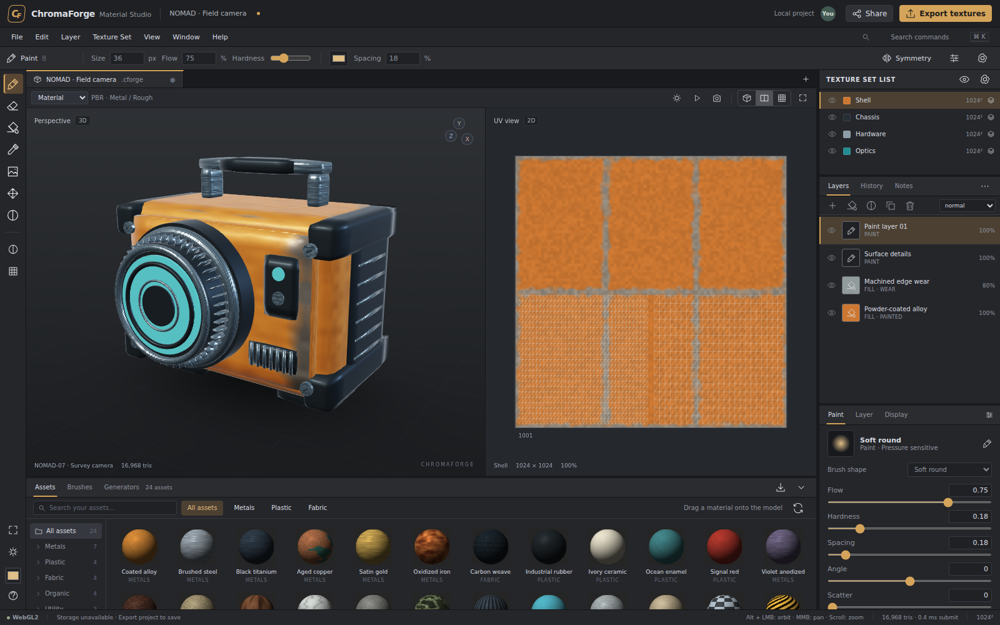

# ChromaForge Material Studio

A working, browser-native material-painting studio and six reusable JavaScript libraries. The application uses plain HTML, CSS and ES modules; it includes an original model and material library, editable texture painting, a WebGPU renderer with fallbacks, and a Node/SQLite collaboration service.

**Release: 0.1.0 — functional engineering preview, not a feature-complete or production-qualified replacement for Adobe Substance 3D Painter.** The interface follows familiar 3D-painting conventions without using Adobe code, logos, UI assets or proprietary file formats. The limitations in [FEATURES.md](docs/FEATURES.md) are part of this release's specification.



## Website and browser editor

- Website: https://wieslawsoltes.github.io/ChromaForgeMaterialStudio/
- Editor: https://wieslawsoltes.github.io/ChromaForgeMaterialStudio/studio/
- Standalone SDK example: https://wieslawsoltes.github.io/ChromaForgeMaterialStudio/examples/renderer.html
- Source: https://github.com/wieslawsoltes/ChromaForgeMaterialStudio

GitHub Pages serves the static website and local browser editor. **Accounts, shared rooms, WebSockets and SQLite require the supplied Node service; they are not hosted by GitHub Pages.** The deployment workflow validates the source, builds `dist/site`, and publishes it after pushes to `main`. Consult the workflow run for deployment status.

## Run the complete application

Install **Node.js 22.16 or newer**. This repository has **zero npm dependencies**; no `npm install` step is needed.

```sh
npm start
```

Open `http://localhost:8787/` for the website or `http://localhost:8787/apps/studio/` for the editor. Keep the server running while using shared rooms. The server binds to loopback by default and creates `data/chromaforge.sqlite`. Node 22 may print an experimental warning for its built-in SQLite API.

The initial project is the original NOMAD survey camera with four independently editable texture sets. Paint directly on the object or in the UV view. Use the material shelf to add procedural fills, the layer panel to reorder/mask layers, and **Export textures** to generate actual PNG files in a ZIP archive.

## Other ways to run

**Standalone editor:** `dist/ChromaForge-Standalone.html` contains the editor, styles, model generators and libraries in one file. It does not fetch third-party assets. Browser restrictions may prevent GPU access or local database access when opening a file directly; the application reports the actual renderer and storage status. Project-file export remains available. For the intended browser origin, serve it over localhost or HTTPS.

**Static website:** upload the contents of `dist/site/` to a static host, or preview them locally:

```sh
python3 -m http.server 8080 --directory dist/site
```

Open `http://localhost:8080/`. Static hosting provides the website and local editor; **it does not provide the collaboration API**. Run the supplied Node server on the same origin for accounts, rooms and live synchronization. The GitHub Pages workflow publishes the static site; no package-registry publication is performed.

## What is working

- Split 3D/UV editing, pressure-aware painting, erasing, masks, UV mirror/repeat modes, line strokes, color picking, text/image decals and editable fill/paint layers.
- Six channels: base color, roughness, metallic, height, emissive and opacity; per-channel editing, six blend modes, procedural materials and replayable strokes.
- A WebGPU viewport implementation, WebGL2 fallback implementation and an explicitly labeled software compatibility renderer. Orbit/pan/zoom, wireframe, material/channel inspection, exposure and procedural studio lighting.
- OBJ import/export and a documented static glTF/GLB geometry subset; BVH surface picking; normal/position/ID/AO/approximate-curvature mesh-map baking; PNG and texture-ZIP export.
- Resizable workspace panels, light/dark themes, compact/comfortable density, command search, project history and review notes.
- IndexedDB project/outbox persistence where the browser permits it, portable `.cforge` documents, and SQLite-backed authenticated collaboration with WebSocket operations, presence, cursors, room roles and revocable invitations.

The brush/compositing and baking pipelines are **CPU Canvas2D/JavaScript**, not WebGPU compute. GPU viewport code is implemented but was not executable in the restricted validation environment. Software rendering is a compatibility path, not a high-performance substitute. Read [QA.md](docs/QA.md) before relying on any performance or compatibility assumption.

## Reusable libraries

| Package | Independent responsibility |
| --- | --- |
| `@chromaforge/core` | Validated document model, operation history, math, events and browser persistence |
| `@chromaforge/geometry` | Mesh primitives, model construction, BVH picking and OBJ/glTF geometry I/O |
| `@chromaforge/paint` | Procedural materials, brush replay, layer compositing, mesh-map baking and PNG/ZIP export |
| `@chromaforge/renderer` | WebGPU/WebGL2/software viewport, camera and graphics-resource lifecycle |
| `@chromaforge/controls` | Reusable range/number editor, splitter, commands and original icons |
| `@chromaforge/collab` | Authenticated room client, operation outbox, reconnect, presence and permissions |

Self-contained ES modules are in `dist/libraries/`. Installable, local npm tarballs are in `dist/packages/`; none are published to npm. Each contains a bundled ES module, TypeScript declarations and an MIT license. The `controls` package requires a DOM when imported. Rendering, compositing and browser persistence require their corresponding browser APIs.

```sh
npm run build
npm run pack:libraries
# Example local installation; adapt the path to your consumer project:
npm install ./dist/packages/chromaforge-core-0.1.0.tgz
```

The independent renderer example is at `http://localhost:8787/examples/renderer.html`. It imports the libraries without the studio application. See [the SDK guide](docs/SDK.md) for a complete minimal renderer and document-operation example.

## Development and verification

```sh
npm run check           # JavaScript syntax and package export checks
npm test                # Core, geometry, protocol, client and live-server tests
npm run build           # Standalone HTML, static site and library bundles
npm run pack:libraries  # Six local npm-compatible tarballs; no publication
```

Optional browser QA requires Python Playwright and Chromium, installed separately. `npm run test:browser` uses an offline HTML context by default; see [QA.md](docs/QA.md) for a normal HTTP-origin run. No browser automation dependency is required to run the application.

## Keyboard and navigation

`B` paint; `E` erase; `G` fill; `I` sample color; `H` pan; `U` mask; `D` decal. `[` / `]` changes brush size. `F` frames the model; `W` toggles wireframe. `F1` / `F2` / `F3` selects split/3D/2D. `Tab` focuses the canvas. `Ctrl/Cmd+K` opens command search. `Ctrl/Cmd+Z` and `Ctrl/Cmd+Shift+Z` undo and redo. `Ctrl/Cmd+S` saves locally; use **Export project** for a portable file. Drag with Alt or the right mouse button to orbit, middle drag to pan, and the wheel to zoom.

## Documentation

- [Implemented features and explicit boundaries](docs/FEATURES.md)
- [Library contracts and examples](docs/SDK.md)
- [Architecture and data flow](docs/ARCHITECTURE.md)
- [Collaboration and security model](docs/SECURITY.md)
- [Deployment, storage and backups](docs/DEPLOYMENT.md)
- [Executed tests and unverified areas](docs/QA.md)

MIT licensed. All bundled model geometry, procedural material definitions and icons were authored for this project. System fonts are used; no font files or third-party texture libraries are distributed.
